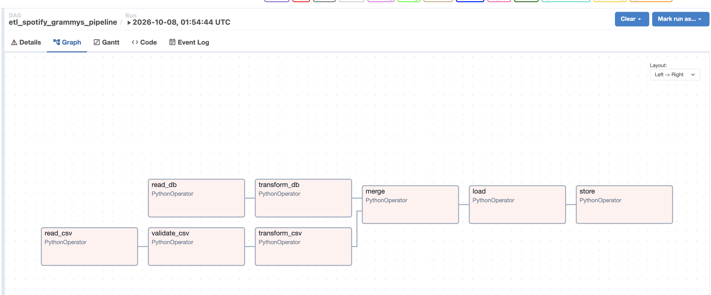
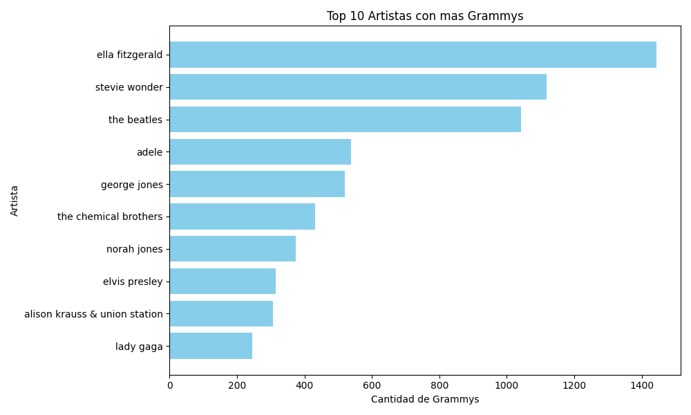

# Workshop 002 - Pipeline ETL con Apache Airflow

**Estudiante:** Alexander Mosquera Fajardo
**Código:** 2247031
**Materia:** ETL (G01)
**Programa:** Ingeniería de Datos e Inteligencia Artificial
**Institución:** UAO - Facultad de Ingeniería y Ciencias Básicas

---

## Descripción del Proyecto

Pipeline ETL automatizado con Apache Airflow que integra dos fuentes de datos:

1. Spotify Tracks Dataset (CSV - 114,000 registros)
2. Grammy Awards Dataset (PostgreSQL - 4,810 registros)

El pipeline realiza:
- Extracción desde CSV y base de datos PostgreSQL
- Validación de calidad con Pandera
- Transformación y normalización de datos
- Merge por nombre de artista
- Carga a PostgreSQL y exportación a CSV
- Reporte estático con visualizaciones

---

## Despliegue con Docker

### ¿Por qué usamos Docker?

Usamos Docker para desplegar Airflow y PostgreSQL porque:

1. Aislamiento: Cada servicio corre en su propio contenedor sin interferir con otros proyectos del servidor.
2. Reproducibilidad: El mismo docker-compose.yml funciona en cualquier máquina (Mac, Linux, GCP).
3. Portabilidad: Podemos mover el stack completo a otro servidor con un solo comando.
4. Gestión de dependencias: Las librerías de Python (Pandas, Pandera, SQLAlchemy) quedan encapsuladas en la imagen.
5. Fácil escalado: Podemos agregar más workers o servicios sin reinstalar nada.

### Mapeo de Puertos

Para evitar conflictos con otros servicios del servidor (SGRD, ETL anterior), usamos puertos personalizados:

| Servicio | Puerto interno | Puerto host | Descripción |
|----------|---------------|-------------|-------------|
| PostgreSQL WS2 | 5432 | 5435 | Base de datos del pipeline |
| Airflow Webserver | 8080 | 8082 | Interfaz web de Airflow |
| Airflow Scheduler | 8080 | — | Orquestador (interno) |

Puertos ocupados por otros proyectos del servidor:
- 5432: PostgreSQL de SGRD
- 5433: PostgreSQL del ETL anterior
- 8001: API de SGRD
- 8080: Frontend del ETL anterior
- 8081: Túnel Cloudflare de SGRD

Por eso elegimos 5435 y 8082 para WS2.

### Servicios en Docker Compose

services:
  postgres_ws2:
    ports: ["5435:5432"]
  airflow-webserver:
    ports: ["8082:8080"]
  airflow-scheduler:
  airflow-init:

### Comandos de Despliegue

docker-compose build
docker-compose up airflow-init
docker-compose up -d
docker ps | grep ws2
docker logs ws2_airflow_webserver

---

## Arquitectura del Pipeline

### Diagrama del DAG en Airflow

El DAG etl_spotify_grammys_pipeline tiene el siguiente flujo:

- Rama Spotify: extract_spotify -> validate_spotify -> transform_spotify
- Rama Grammys: extract_grammys -> transform_grammys
- Merge: merge_datasets (une por nombre de artista)
- Salida: load_to_db y save_csv (en paralelo)

---

## Stack Tecnológico

| Componente | Tecnología | Versión |
|------------|-----------|---------|
| Orquestador | Apache Airflow | 2.11.2 |
| Base de Datos | PostgreSQL | 16 |
| Lenguaje | Python | 3.11 |
| Procesamiento | Pandas | 2.2.2 |
| Validación | Pandera | 0.20.4 |
| ORM | SQLAlchemy | 1.4.52 |
| Contenedores | Docker + Docker Compose | - |
| Cloud Storage | Google Cloud Storage | - |
| Túnel | Cloudflare Tunnel | - |

---

## Estructura del Proyecto

workshop-etl-ws2/
├── dags/
│   └── etl_workshop.py
├── scripts/
│   ├── etl_functions.py
│   └── setup_db.py
├── notebooks/
│   └── reporte_estatico.py
├── data/
│   ├── spotify_tracks.csv
│   ├── grammys.csv
│   └── merged_spotify_grammys.csv
├── screenshots/
│   ├── dag_graph.png
│   └── grafico_top_artistas.png
├── credentials/
│   └── gcp-key.json
├── docker-compose.yml
├── Dockerfile
├── requirements.txt
├── .env
├── .gitignore
└── README.md

---

## Cómo Reproducir

### Requisitos Previos
- Docker y Docker Compose instalados
- Cuenta de Google Cloud con bucket creado
- Cuenta de Cloudflare (para túnel)

### Pasos

git clone https://github.com/alexelgordo72/workshop-etl-ws2.git
cd workshop-etl-ws2
docker-compose up -d
docker-compose up airflow-init
docker-compose run --rm -e POSTGRES_HOST=postgres_ws2 -e POSTGRES_PORT=5432 airflow-webserver python /opt/airflow/scripts/setup_db.py

---

## Resultados del Pipeline

### Métricas del ETL

| Etapa | Registros |
|-------|-----------|
| Spotify (extraídos) | 114,000 |
| Spotify (después de limpiar nulos) | 113,999 |
| Spotify (transformados) | 89,740 |
| Grammys (extraídos) | 4,810 |
| Grammys (transformados) | 4,647 |
| Merge (unidos) | 14,558 |

### Visualización: Top 10 Artistas con más Grammys

| Artista | Total Grammys | Popularidad Promedio |
|---------|---------------|----------------------|
| Ella Fitzgerald | 1,443 | 0.99 |
| Stevie Wonder | 1,118 | 1.00 |
| The Beatles | 1,043 | 60.32 |
| Adele | 539 | 65.12 |
| George Jones | 520 | 16.56 |
| The Chemical Brothers | 432 | 29.32 |
| Norah Jones | 375 | 4.87 |
| Elvis Presley | 315 | 53.11 |
| Alison Krauss & Union Station | 306 | 25.29 |
| Lady Gaga | 246 | 1.37 |

---

## URLs y Accesos

- Airflow UI: https://performs-powder-generic-speaks.trycloudflare.com
- Usuario: admin
- Contraseña: admin
- PostgreSQL WS2: localhost:5435
- Bucket GCS: gs://ws2-etl-bucket/

---

## Notas

- Los archivos .env, data/*.csv, credentials/*.json están excluidos de git.
- El bucket de GCS contiene los datasets de entrada y el resultado del merge.
- El túnel de Cloudflare se regenera en cada reinicio (URL cambia).
- La validación con Pandera tolera nulos después de la limpieza inicial.

---

## Autor

Alexander Mosquera Fajardo - Código 2247031
Estudiante de Ingeniería de Datos e IA - 5to Semestre

---

Proyecto desarrollado para el Workshop 002 de la materia ETL (G01)
